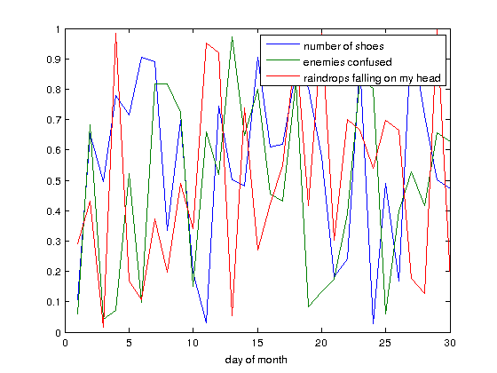
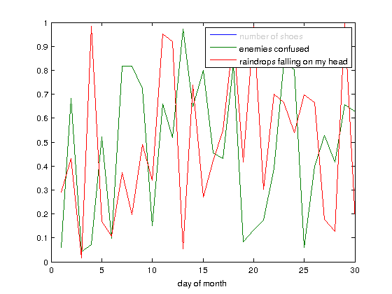

# legend_curve_selector
Add toggle functionality to the legend entries of a plot: switch individual data sets on or off.

## How To Use It?
The usage of this little function is easy. After having created a plot as usual, e.g.

```matlab
% clear the workspace
clear, close all, clc

% generate a random matrix
mat_data = rand(30, 3);

% plot the data
figure(1);
plot(mat_data);
xlabel('day of month');
```

... and adding a legend

```matlab
% create a standard legend
% (and obtain the handle)
legend({'number of shoes', ...
        'enemies confused', ...
        'raindrops falling on my head'});
```

the legend entries can be transformed into toggle switches as easy as this:

```matlab
% now change the legend to be clickable
legend_curve_selector(legend);
```

## How Does It Look Like?
With all entries switched on the legend looks as always:


Toggling a legend entry by clicking on it switches off the associated data set and changes the color of the legend text to gray:

